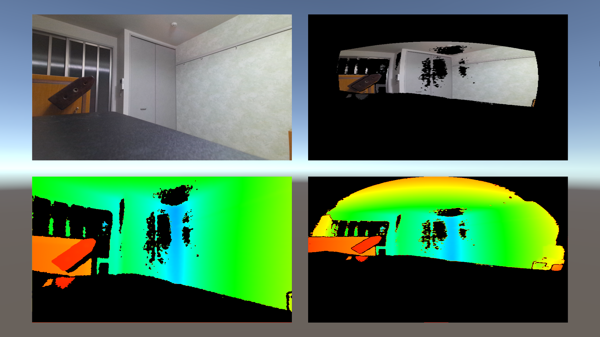
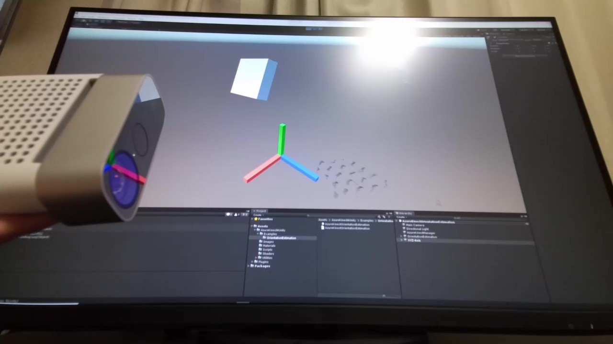
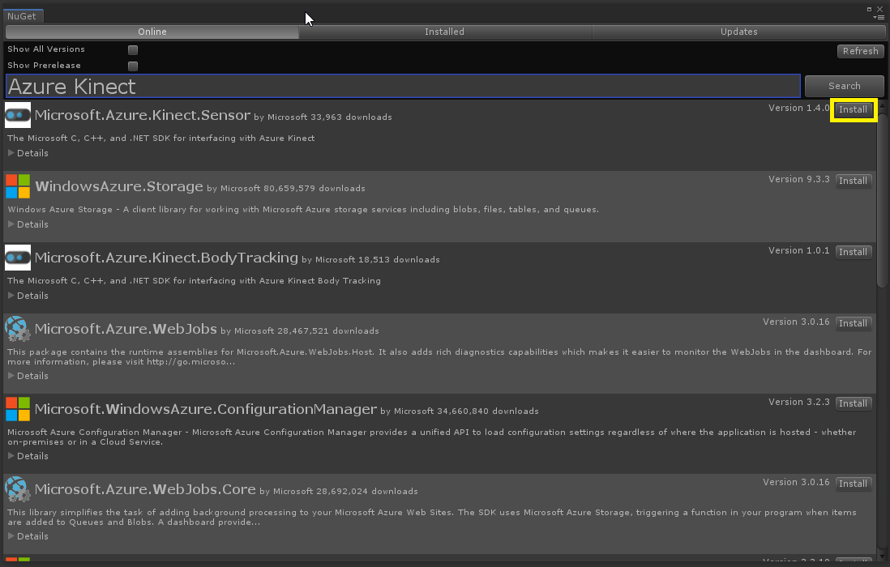
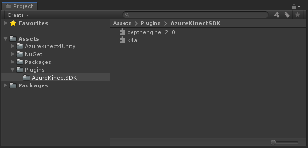
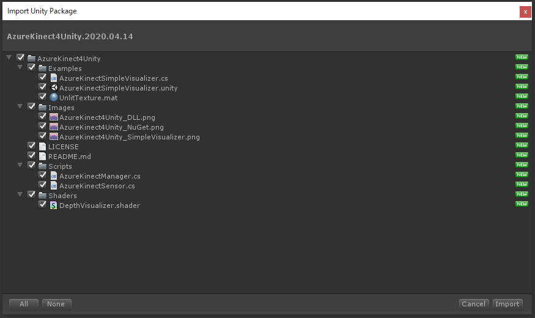

# Azure Kinect for Unity

## Examples
SimpleVisualizer

OrientationEstimator  

## Tested environment
- Unity 2018.4.21f1
- Azure Kinect SDK 1.4.0
- Windows 10

## Initial setup for a new project
### 1. Install Azure Kinect SDK
https://github.com/microsoft/Azure-Kinect-Sensor-SDK/blob/develop/docs/usage.md

### 2. Setup a Unity project
2.1. Create a new Unity project  

2.2. Download and import NuGetForUnity (NuGetForUnity.2.0.0.unitypackage)  
https://github.com/GlitchEnzo/NuGetForUnity/releases/tag/v2.0.0

2.3. Install Microsoft.Azure.Kinect.Sensor package

2.4. Copy dll files from the SDK folder  
Copy "depthengine_2_0.dll" and "k4a.dll" from the SDK installation folder to Plugins folder.

SDK installation folder  
C:\Program Files\Azure Kinect SDK v1.4.0\sdk\windows-desktop\amd64\release\bin

Plugins folder

2.5. Import AzureKinect4Unity

## Third party assets
このプロジェクトには、以下のアセットが含まれています。  
The following assets are included in this project.

- Microsoft Azure Kinect Sensor SDK  
  Microsoft Azure Kinect Sensor SDK files (the .dll files contained in the Assets/Plugins/AzureKinectSDK.1.4.0 directory) are distributed under the Microsoft Software License Terms.  

  Please see the following license page for complete terms.  
  https://www.nuget.org/packages/Microsoft.Azure.Kinect.Sensor/1.4.0/License

- System.Buffers.4.4.0  
  Licensed under the MIT License. Copyright (c) .NET Foundation and Contributors.

- System.Memory.4.5.3  
  Licensed under the MIT License. Copyright (c) .NET Foundation and Contributors.

- System.Numerics.Vectors.4.5.0  
  Licensed under the MIT License. Copyright (c) .NET Foundation and Contributors.

- System.Runtime.CompilerServices.Unsafe.4.5.2  
  Licensed under the MIT License. Copyright (c) .NET Foundation and Contributors.  

## License
このプロジェクトは、サードパーティのアセットを除き、MIT Licenseでライセンスされています。  
This project is licensed under the MIT License excluding third party assets.
